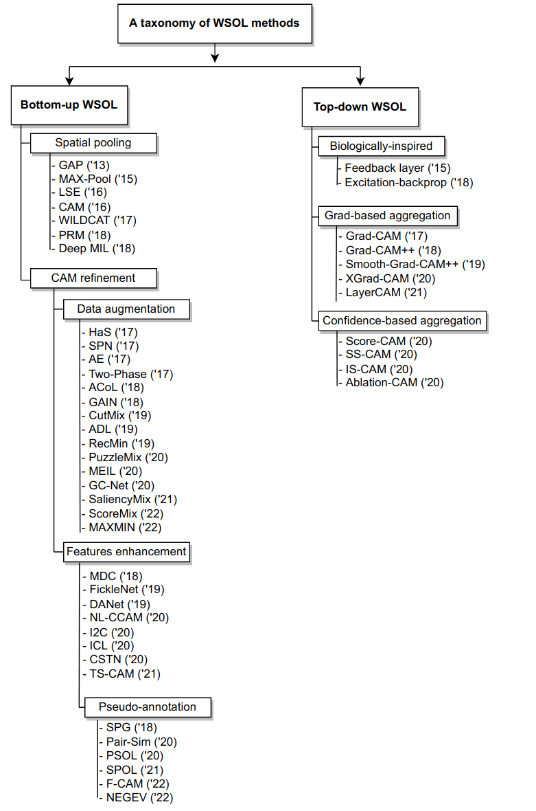
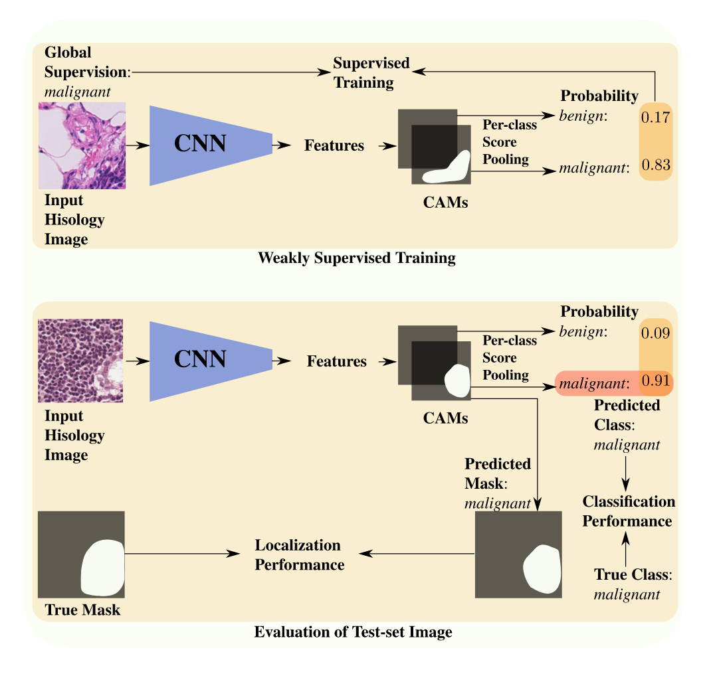
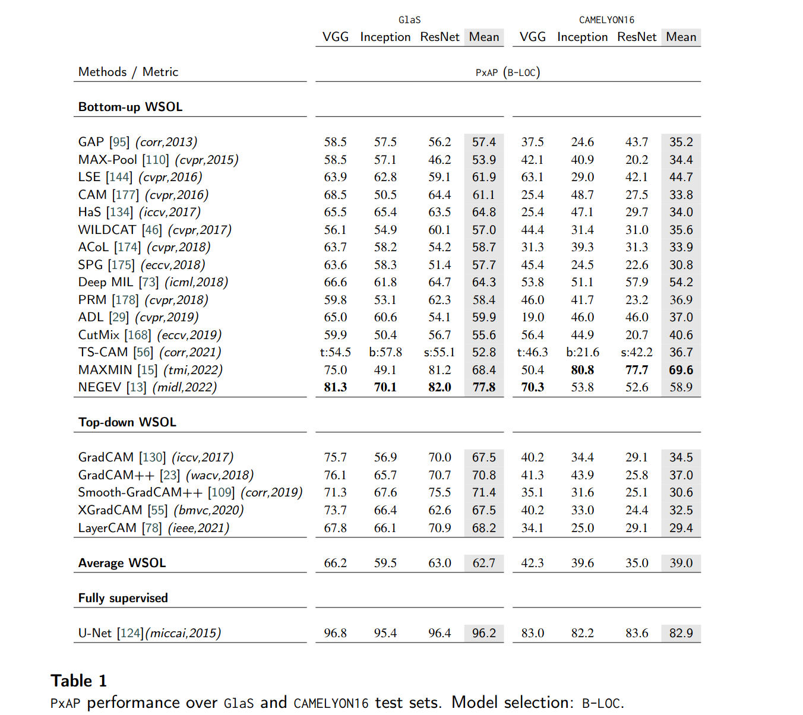
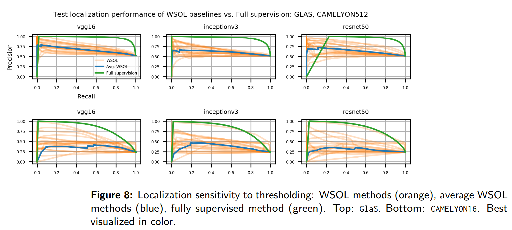
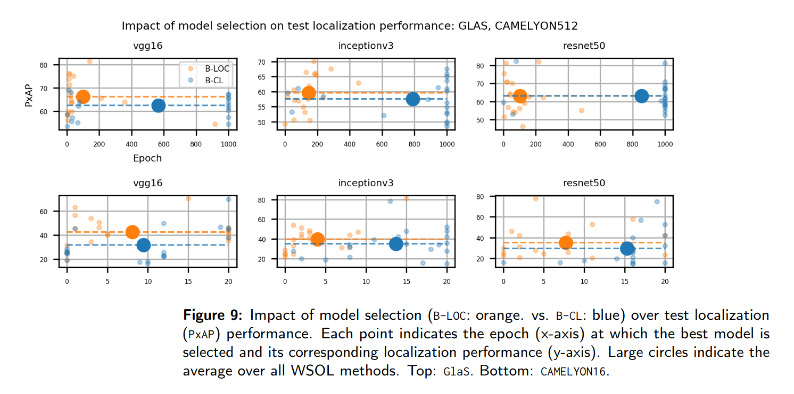
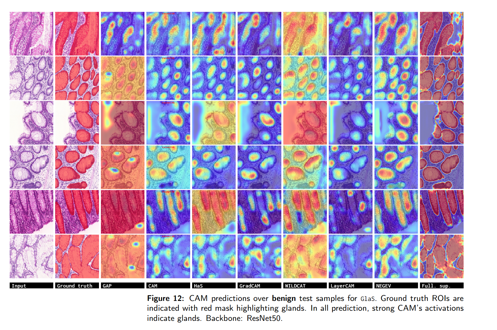
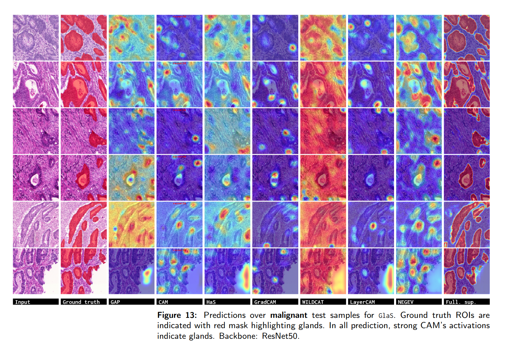
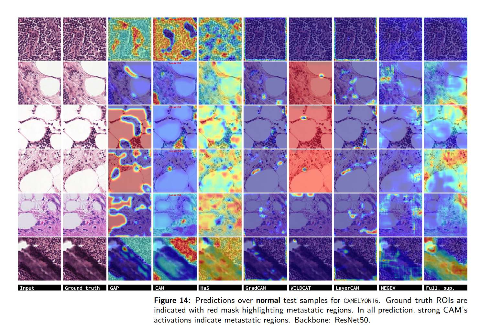
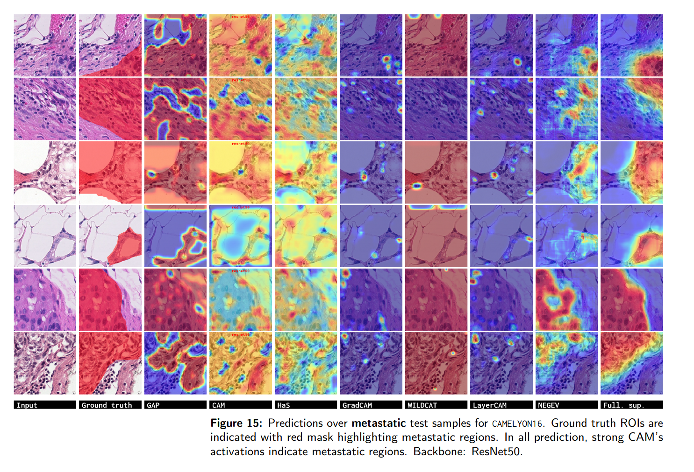

# [Deep Weakly-Supervised Learning Methods for Classification and Localization in Histology Images: A Survey (Machine Learning for Biomedical Imaging 2023)](https://www.melba-journal.org/pdf/2023:004.pdf)


by
**Jérôme Rony<sup>1</sup>,
Soufiane Belharbi<sup>1</sup>,
Jose Dolz<sup>2</sup>,
Ismail Ben Ayed<sup>1</sup>,
Luke McCaffrey<sup>3</sup>,
Eric Granger<sup>1</sup>**


<sup>1</sup> LIVIA, Dept. of Systems Engineering, ETS Montreal, Canada
<br/>
<sup>2</sup> LIVIA, Dept. of Software and IT Engineering, ETS Montreal, Canada
<br/>
<sup>3</sup> Goodman Cancer Research Centre, Dept. of Oncology, McGill University, Montreal, Canada

<p align="center"></p>

[](https://www.melba-journal.org/papers/2023:004.html)
[](https://www.melba-journal.org/pdf/2023:004.pdf)
[](https://sbelharbi.github.io/publications/2023/poster-midl-2023.pdf)

## Abstract
Using state-of-the-art deep learning (DL) models to diagnose cancer from histology data presents several challenges related to the nature and availability of labeled histology images, including image size, stain variations, and label ambiguity. In addition, cancer grading and the localization of regions of interest (ROIs) in such images normally rely on both image- and pixel-level labels, with the latter requiring a costly annotation process. Deep weakly-supervised object localization (WSOL) methods provide different strategies for low-cost training of DL models. Given only image-class annotations, these methods can be trained to simultaneously classify an image, and yield class activation maps (CAMs) for ROI localization.
This paper provides a review of deep WSOL methods to identify and locate diseases in histology images, without the need for pixel-level annotations. We propose a taxonomy in which these methods are divided into bottom-up and top-down methods according to the information flow in models. Although the latter have seen only limited progress, recent bottom-up methods are currently  driving a lot of progress with the use of deep WSOL methods. Early works focused on designing different spatial pooling functions. However, those methods quickly peaked in term of localization accuracy and revealed a major limitation, namely, -- the under-activation of CAMs, which leads to high false negative localization. Subsequent works aimed to alleviate this shortcoming and recover the complete object from the background, using different techniques such as perturbation, self-attention, shallow features, pseudo-annotation, and task decoupling.
In the present paper, representative deep WSOL methods from our taxonomy are also evaluated and compared in terms of classification and localization accuracy using two challenging public histology datasets -- one for colon cancer (GlaS), and a second, for breast cancer (Camelyon16).  Overall, the results indicate poor localization performance, particularly for generic methods that were initially designed to process natural images. Methods designed to address the challenges posed by histology data often use priors such as ROI size, or additional pixel-wise supervision estimated from a pre-trained classifier, allowing them to achieve better results. However, all the methods suffer from high false positive/negative localization. Classification performance is mainly affected by the model selection process, which uses either the classification or the localization metric. Finally, four key challenges are identified in the application of deep WSOL methods in histology, namely, -- under-/over-activation of CAMs, sensitivity to thresholding, and model selection -- and research avenues are provided to mitigate them.  Our code is publicly available at [github.com/jeromerony/survey_wsl_histology](https://github.com/jeromerony/survey_wsl_histology).


**Code: Pytorch 1.10.0.**

### Citation:
```
@article{rony2023deep,
    title ={Deep Weakly-Supervised Learning Methods for Classification and Localization in Histology Images: A Survey},
    author={Rony, J. and Belharbi, S. and Dolz, J. and Ben Ayed, I. and McCaffrey, L. and Granger, E.},
    journal = "Machine Learning for Biomedical Imaging",
    volume = "2",
    year = "2023",
    pages = "96--150"
}
```


### Content:
* [View](#view)
* [Results](#results)
* [Requirements](#reqs)
* [Datasets](#datasets)
* [Run code](#run)


#### <a name='view'> Method</a>:



Installed methods:
- GAP
- Max-Pooling
- LSE
- CAM
- HaS
- WILDCAT
- ACoL
- SPG
- Deep MIL
- PRM
- ADL
- CutMix
- TS-CAM
- MAXMIN
- NEGEV
- GradCAM
- GradCAM++
- Smooth-GradCAM++
- LayerCAM
- U-Net

#### <a name='results'> Results</a>:
















#### <a name='reqs'> Requirements</a>:

* Python 3.7.10
* [Pytorch](https://github.com/pytorch/pytorch)  1.10.0
* [torchvision](https://github.com/pytorch/vision) 0.11.1
```shell
pip install torch==1.10.0 -f https://download.pytorch.org/whl/cu111/torch-1.10.0%2Bcu111-cp37-cp37m-linux_x86_64.whl
pip install torchvision==0.11.1 -f https://download.pytorch.org/whl/cu111/torchvision-0.11.1%2Bcu111-cp37-cp37m-linux_x86_64.whl
```
* [Full dependencies](dependencies/requirements.txt)
* Build and install CRF:
    * Install [Swig](http://www.swig.org/index.php)
    * CRF (not used in this work, but it is part of the code.)

```shell
cdir=$(pwd)
cd dlib/crf/crfwrapper/bilateralfilter
swig -python -c++ bilateralfilter.i
python setup.py install
cd $cdir
cd dlib/crf/crfwrapper/colorbilateralfilter
swig -python -c++ colorbilateralfilter.i
python setup.py install
```

#### <a name="datasets"> Download datasets </a>:
#### 2.1. Links to dataset:
* [GlaS](https://warwick.ac.uk/fac/sci/dcs/research/tia/glascontest)
* [Camelyon16](https://github.com/jeromerony/survey_wsl_histology)


#### 2.2. Download datasets:

* GlaS: [./download-glas-dataset.sh](./download-glas-dataset.sh).

You find the splits in [./folds](./folds).


### 2.3 Code for datasets split/sampling (+ patches sampling from WSI):
* See [datasets-split](https://github.com/jeromerony/survey_wsl_histology/tree/init-branch/datasets-split).
* Detailed documentation: [datasets-split/README.md](https://github.com/jeromerony/survey_wsl_histology/blob/init-branch/datasets-split/README.md).

#### <a name="datasets"> Run code </a>:

* CAM-method: CAM over GLAS using ResNet50:
```shell
cudaid=$1
export CUDA_VISIBLE_DEVICES=$cudaid
getfreeport() {
freeport=$(python -c 'import socket; s=socket.socket(); s.bind(("", 0)); print(s.getsockname()[1]); s.close()')
}
export OMP_NUM_THREADS=50
export NCCL_BLOCKING_WAIT=1
plaunch=$(python -c "from os import path; import torch; print(path.join(path.dirname(torch.__file__), 'distributed', 'launch.py'))")
getfreeport
torchrun --nnodes=1 --node_rank=0 --nproc_per_node=1  \
                         --master_port=$freeport main_wsol.py \ --local_world_size=1 \
                         --task STD_CL \
                         --encoder_name resnet50 \
                         --arch STDClassifier \
                         --runmode final-mode \
                         --opt__name_optimizer sgd \
                         --batch_size 32 \
                         --eval_checkpoint_type best_localization \
                         --opt__step_size 250 \
                         --opt__gamma 0.1 \
                         --max_epochs 1000 \
                         --freeze_cl False \
                         --support_background True \
                         --method CAM \
                         --spatial_pooling WGAP \
                         --dataset GLAS \
                         --fold 0 \
                         --cudaid 0 \
                         --debug_subfolder None \
                         --amp True \
                         --opt__lr 0.003 \
                         --exp_id 11_19_2021_09_32_36_109051__423849
```
